# Design

Organization for the requirements in [product-requirements.md](product-requirements.md). M0–M5 are implemented; later modules remain planned. Technical constraints and unresolved contracts live in [technical-requirements.md](technical-requirements.md).

## System

```mermaid
flowchart TB
    subgraph Browser["Browser — React / TypeScript; locally bundled assets"]
        Login["Shared login<br/>admin or student roll number"]
        StudentUI["Student screens<br/>Lab entry, PDFs, Markdown, countdown<br/>C upload, history, compiler feedback"]
        AdminUI["Admin screens<br/>Accounts, task library, labs<br/>Submission review, retries, Isolates"]
        Client["HTTP client<br/>Session and binding cookies; CSRF token"]
        LiveUI["EventSource<br/>Invalidation triggers authoritative refetch"]
        Login --> StudentUI
        Login --> AdminUI
        Login --> Client
        StudentUI --> Client
        AdminUI --> Client
        LiveUI --> Client
    end

    subgraph Deployment["Docker Compose — Linux host / cgroup v2"]
        subgraph DefaultNetwork["Default network — web / api / db"]
            subgraph Web["web container — only published ports: 8080 / 8443"]
                Nginx["nginx<br/>HTTP redirect, HTTPS termination<br/>API proxy; unbuffered SSE"]
                Assets["Static frontend<br/>HTML, JavaScript, CSS"]
                Nginx --> Assets
            end
            subgraph API["api container — FastAPI; private port 8000"]
                Routes["HTTP routes<br/>Trusted hosts; separate role response models"]
                Identity["identity<br/>Accounts, encrypted credential reprints<br/>Sessions, role / origin / CSRF guards"]
                Tasks["tasks<br/>Drafts, case validation, immutable revisions"]
                Labs["labs<br/>Scheduling, enrollment, PDFs, announcements<br/>Binding, strict IP, freeze, deadlines"]
                Admission["submissions<br/>Bounded upload, idempotency, durable source<br/>Locked deadline / cooldown / pending checks"]
                Controls["judging admin API<br/>Isolates status, audited fault retry<br/>Compiler-feedback visibility"]
                SQL["SQLAlchemy Core<br/>Short PostgreSQL transactions and locks"]
                Events["SSE event hub<br/>One PostgreSQL LISTEN connection<br/>Coalesced invalidations; session revalidation"]
                Routes --> Identity
                Identity --> Tasks
                Identity --> Labs
                Identity --> Admission
                Identity --> Controls
                Admission -->|"reuse lab / enrollment / binding policy"| Labs
                Tasks --> SQL
                Labs --> SQL
                Admission --> SQL
                Controls --> SQL
                Identity --> SQL
            end
            Nginx -->|"HTTP requests; trusted client IP"| Routes
            Events -->|"SSE stream"| Nginx
        end

        subgraph Database["db container — PostgreSQL 17; joins both networks"]
            PG["SQL + transactional NOTIFY / LISTEN"]
            AccountsDB["Accounts, sessions, login attempts, audits"]
            AuthoringDB["Task drafts / revisions<br/>Labs, ordered assignments, enrollments<br/>PDF versions, announcements"]
            SubmissionDB["Immutable submission evidence<br/>Acceptance time, source hash, IP / nullable MAC"]
            QueueDB["Fair queue and student turns<br/>Jobs, attempts, lease IDs, worker generations<br/>Worker status and heartbeats"]
            ResultsDB["Judge runs and case results<br/>Exact scores, diagnostics, bounded previews"]
            PG --- AccountsDB
            PG --- AuthoringDB
            PG --- SubmissionDB
            PG --- QueueDB
            PG --- ResultsDB
        end

        subgraph JudgeNetwork["judge_queue network — internal; worker / db only"]
            subgraph WorkerContainer["worker container — one supervised process pool"]
                Supervisor["Supervisor<br/>CJUDGE_SANDBOX_INSTANCES = N<br/>Restart backoff; container memory budget"]
                Pool["Workers 0 .. N-1<br/>One active submission per worker<br/>Startup compile / execute check"]
                Scheduler["PostgreSQL queue client<br/>Round-robin students; FIFO submissions<br/>Claims, lease renewal, retry / crash recovery"]
                Runner["runner<br/>Compile once; execute every case<br/>Per-worker box ID, metadata and lock"]
                Checker["Built-in exact / token comparison<br/>Full permitted stdout checked outside sandbox<br/>Exact scoring; bounded preview retention"]
                Publish["Fenced result transaction<br/>Current attempt + generation + live lease<br/>Run / cases / completion + notifications"]
                subgraph Isolation["isolate boundary — distinct UID / cgroup per worker"]
                    Compile["Compilation profile<br/>GCC C11 / libm; bounded subprocesses"]
                    Execute["Execution profile<br/>Fresh writable state per case<br/>One process; CPU / wall / memory / output limits"]
                    Restrictions["No network, answers, credentials<br/>or other submissions<br/>Sandbox cleanup after each run"]
                end
                Supervisor --> Pool
                Pool --> Scheduler
                Scheduler -->|"leased submission + pinned revision"| Runner
                Runner --> Compile
                Compile -->|"executable returned to worker memory"| Runner
                Runner --> Execute
                Compile --- Restrictions
                Execute --- Restrictions
                Execute -->|"bounded output + execution metrics"| Checker
                Checker --> Publish
                Runner -->|"compile error / diagnostics"| Publish
            end
        end

        subgraph Storage["Persistent Docker volumes — retained across container recreation"]
            DBVolume[("postgres_data<br/>Metadata, queue, results, audits")]
            Keys[("credential_keys<br/>Encrypted-credential key")]
            Cases[("task_files<br/>Immutable input / answer case sets")]
            PDFs[("lab_files<br/>Versioned lab PDF attachments")]
            Sources[("submission_files<br/>Immutable UUID source files")]
        end

        subgraph Operations["Explicit setup / test operations — not runtime probes"]
            KeyInit["key-init container<br/>One-time key creation"]
            Migrations["API image CLI<br/>Alembic schema migrations"]
            Gate["Standalone judge container<br/>M1 isolation gate; no network or app volumes<br/>Run with runtime worker stopped"]
        end

        subgraph Future["Planned modules — M6–M8; not implemented"]
            Marks["M6: marks, attempt ordering, deletion / restoration<br/>Network-change review; single / batch rejudge"]
            Authoring["M7: Python authoring<br/>Sandboxed custom checkers<br/>Generators + reference solution + draft review"]
            Release["M8: release gates and result disclosure<br/>Scoreboards, mark sheets, versioned archives"]
        end
    end

    Client -->|"HTTPS API / protected downloads"| Nginx
    Assets -->|"frontend bundle"| Browser
    Nginx -->|"HTTPS SSE"| LiveUI
    SQL -->|"read / write; cjudge_jobs + cjudge_events NOTIFY"| PG
    PG -->|"cjudge_events LISTEN"| Events
    Scheduler <-->|"claim / renew / status; cjudge_jobs LISTEN"| PG
    PG -->|"revision and case metadata"| Runner
    Publish -->|"atomic result write + cjudge_events NOTIFY"| PG
    PG --- DBVolume
    Identity -->|"read only"| Keys
    Tasks -->|"read / write"| Cases
    Labs -->|"read / write"| PDFs
    Admission -->|"fsync source before acceptance; protected reads"| Sources
    Cases -->|"read-only worker mount; answers stay outside execution box"| Checker
    Cases -->|"read-only worker mount; input passed to execution"| Runner
    Sources -->|"read-only worker mount"| Runner
    KeyInit -->|"initial write"| Keys
    Migrations -->|"schema changes"| PG
    Marks -.->|"future APIs and result publication"| PG
    Marks -.->|"future rejudge jobs"| Scheduler
    Authoring -.->|"future checker / generator profiles"| Runner
    Authoring -.->|"future reviewed case publication"| Cases
    Release -.->|"future official marks / history reads"| PG
    Release -.->|"future authorized release / downloads"| Routes
    Release -.->|"future archive reads: sources / PDFs / cases"| Storage

    classDef planned fill:#fff7ed,stroke:#c4a77d,stroke-dasharray:5 5,color:#5b4636
    class Marks,Authoring,Release planned
```

**Legend:** solid arrows show implemented requests, data access, or execution; plain lines group storage / constraints. Dashed arrows and shaded nodes show planned modules. Container and network boundaries describe Compose deployment; database groups are logical table families.

- **Access:** only nginx publishes ports, bound to localhost by default; LAN deployment changes the web binding and certificate/origin configuration. The browser cannot connect directly to PostgreSQL or workers. Protected downloads pass through API authorization.
- **Admission:** the API stores and fsyncs source before acceptance, then applies server-time policy under lab/enrollment locks and commits submission/job records. Idempotent retries recover the original record. Source cleanup coordinates with admission through an artifact lock.
- **Judging:** one runtime container hosts N independent worker processes and isolate identities. Compilation and execution use separate profiles sequentially within each worker's box; every case gets clean writable state. Workers keep answers outside student sandboxes and publish only under a valid lease. Infrastructure faults remain pending rather than becoming student zeros.
- **Live status:** PostgreSQL notifications wake workers and invalidate browser snapshots. Worker heartbeats establish liveness; SSE refreshes authorized views. Isolates expires stale status locally. No recurring sandbox or HTTP health probes run.
- **Persistence:** back up PostgreSQL with the credential key and all artifact volumes. Worker mounts are read-only; writable sandbox files, executables, and metadata are temporary. MAC capture remains unavailable until a trusted LAN integration exists.

Backend packages currently implement identity, tasks, labs, submissions, and judging. Marks/rejudge, Python authoring, release, and exports extend these boundaries in later modules.

## Screens

Use a DOMjudge-inspired layout for both student and admin interfaces: compact navigation, dense task/submission tables, clear status labels, and a visible server-based lab countdown. Use a light theme and native form controls: consistent blue buttons, yellow notices/announcements, and red frozen/blocked states or errors. Keep labels and visible focus; do not rely on color alone. DOMjudge is a layout reference; exact visual matching and source-code reuse are not required. Retain React and Tailwind without adding a UI framework.

| Student | Admin |
| --- | --- |
| Login and binding-block explanation | Accounts, CSV import, credentials, binding release |
| Lab countdown, lab PDF links, and ordered task table | Lab overview, PDF uploads, common deadline, student table, progress |
| Optional task Markdown, file upload, submission history table | Task library, Markdown textarea/preview, test editor, generation review, revisions |
| Submission status and released details | Submission filters, best-to-worst attempts, deleted runs, judging faults |
| Optional solved-task scoreboard | Corrections, release, marks, archive export |

Use one login form with username/roll number and password. Detect `admin` automatically, case-insensitively; reserve that identifier from student roll numbers.

Keep the student path short: read, upload, check status. Explain disabled uploads with the actual reason: closed lab, cooldown, or pending limit. Server checks remain authoritative. Show infrastructure faults separately from student failures.

Store PDFs on the lab, not individual tasks. List all lab PDFs on the dashboard and link back to them from task pages. Omit empty task statements; render provided Markdown safely. Hide both document types until the lab starts.

Use readable layouts, labeled controls, keyboard-accessible navigation, visible focus, and text alongside status colors. Keep tables usable on narrow screens. Render source and diagnostics as escaped monospace text. Bundle assets locally. Preserve cJudge's grading and visibility rules: student views expose no partial marks or hidden cases before release.

Confirm destructive or grading-changing admin actions and show their effects. Collect required audit reasons. Separate archive download from permanent deletion.

### UI Acceptance Checks

- Student: login → lab PDFs / optional task statement → upload → result; verify multiple PDFs and tasks without Markdown.
- Admin: task setup → lab management → review → release.
- Verify keyboard navigation, narrow-screen tables, countdown updates, and role-based visibility.

## Data Model

- Account, revocable session, and per-lab browser binding.
- Lab with versioned PDF attachments, announcements, frozen/bound enrollment, and ordered pinned task revisions.
- Reusable task with optional Markdown statement, immutable revision, and test cases.
- Submission with immutable source, acceptance time, and soft-delete metadata.
- Submission network snapshot: client IP, optional trusted MAC, MAC source/observation time. Admin attempt review displays addresses, unavailable MACs, and possible PC-switch flags across the student's lab submissions.
- Queue job/attempt with lease identity; judge run and case results tied to a revision.
- Rejudge batch, audit event, and export metadata.

A submission can have multiple judge runs. Store first-release history separately from current reveal visibility. Exact tables and schemas must be designed before implementation.

## Main Flows

1. **Submit:** receive/validate source, persist safely, enforce deadline/cooldown/backlog atomically, create submission and job, then acknowledge durable acceptance.
2. **Judge:** claim a lease, compile, execute every case in clean environments, check complete permitted output, and publish results only for the current attempt.
3. **Correct:** publish a revision, queue all affected active attempts, preserve prior results, and switch official marks together after the replacement batch succeeds. Define concurrent arrivals/deletions explicitly before implementing this transaction.
4. **Release:** verify lab closure and resolved judging, warn on test reuse, record first release permanently, and enable authorized details.
5. **Export:** use official marks for sheets and include retained history in archives; never implicitly delete data.

SSE prompts state refresh. Reconnect by fetching authoritative state; a dropped connection does not change grades or deadlines. Never show upload success without a confirmed submission record.

## Delivery Order

Follow [todo.md](todo.md) for module dependencies, milestones, and per-module test gates.
