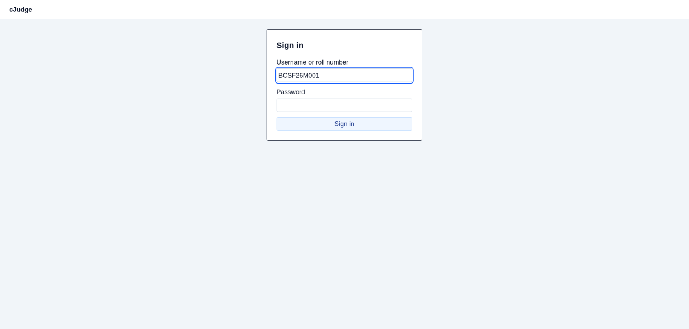
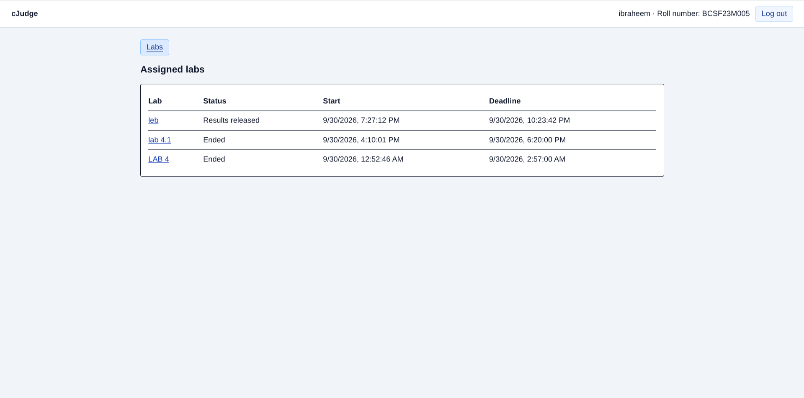
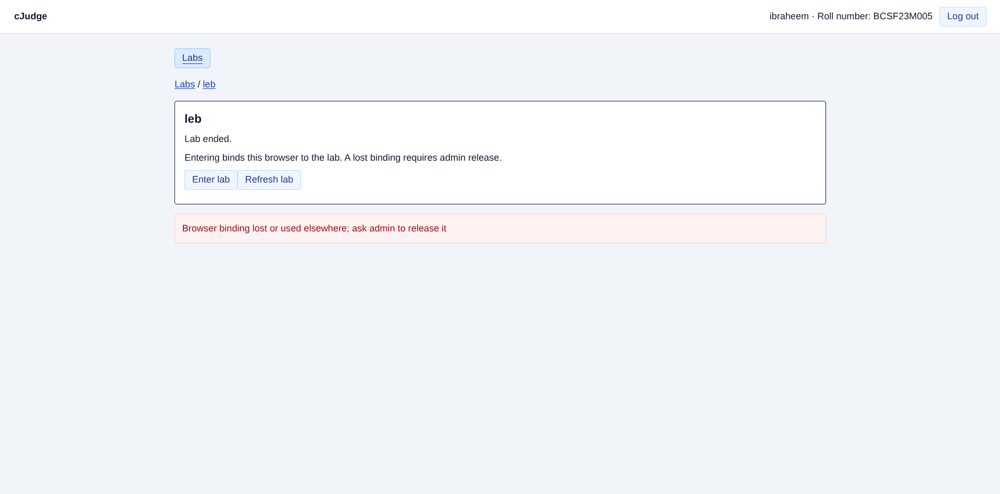
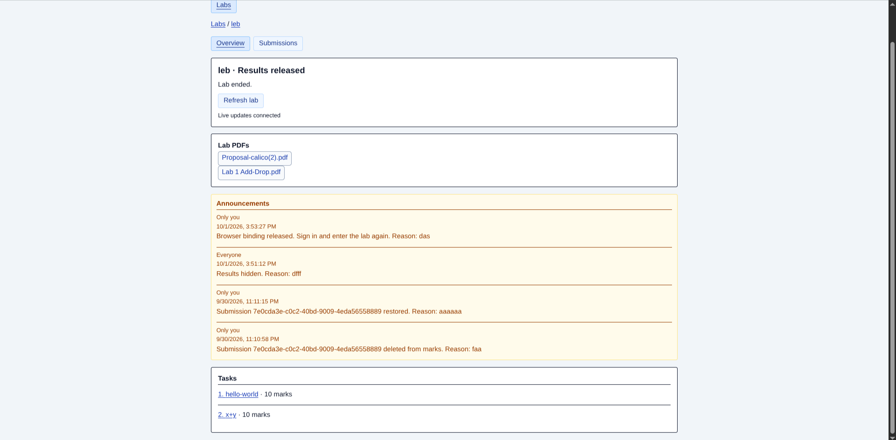
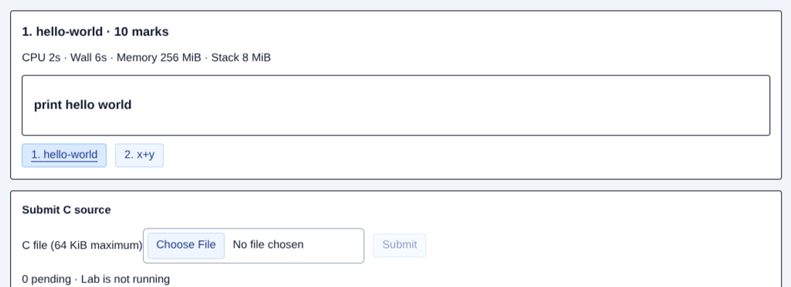

# cJudge Student Guide

**During the lab:** sign in → enter your lab → read a task → upload C source → check acceptance and status → log out.

## 1. Sign in

1. Connect to the lab network; open the instructor's HTTPS address.
2. Enter your roll number and password, then click **Sign in**.
3. Confirm your name and roll number in the header.

For certificate warnings, ask the instructor to set up trust before entering credentials. Never share your password.

## 2. Enter the assigned lab

1. Under **Assigned labs**, click your lab; check its start and deadline.
2. Click **Enter lab** after the start. Materials are hidden beforehand.
3. Keep the same computer/browser. Do not clear cookies or use a private window.

**Sign in** identifies you; **Enter lab** binds your browser. Refresh preserves binding; losing it requires admin release.

*These example labs have ended; choose the lab assigned by your instructor.*

*This example shows a lost browser binding: ask admin to release it before re-entry. An ended lab does not accept new uploads.*

## 3. Read the instructions

1. Check **Time remaining** and announcements on **Overview**. **Only you** means a private notice.
2. Download **Lab PDFs**; one PDF may cover several tasks.
3. Click a task; read its statement and resource limits. Use task links to switch tasks.

Watch for extensions/corrections. Use **Refresh lab** if information appears stale.

*This example is an ended lab. During a running lab, also check the remaining time.*

## 4. Submit your program

1. Save C source in your editor; upload neither an executable nor ZIP.
2. On the correct task, under **Submit C source**, select a nonempty `.c` file, maximum **64 KiB**, named plainly, e.g. `main.c`.
3. Check **Selected: main.c**; click **Submit**.
4. Wait for **Accepted … at …** and a history row. Acceptance means saved, not passed.

Uploads must finish before the server deadline. Selecting a file is insufficient; submit early.

*Uploads are disabled here because the lab has ended. During a running lab, choose your file before clicking **Submit**.*

## 5. Check your submissions

The task page shows its history. **Submissions** lists all tasks, newest first, with **Filter by task** and **Older submissions**/**Newer submissions**.

| Status | Meaning / action |
| --- | --- |
| Queued — yellow | Saved; waiting for a sandbox. |
| Judging — blue | Execution is in progress. |
| Passed — green | All cases passed. |
| Failed — red | One or more cases failed; check your program. |
| Compile error — red | Compilation failed; read feedback if the instructor enabled it. |
| Judging delayed — yellow | Grading needs attention; tell the instructor. This is not a failed program. |

Deleted submissions remain red with a reason and are excluded from marks. Source, submission marks, and testcase details stay hidden during the lab.

If the instructor enables **Scoreboard**, open it from lab navigation. Standings rank total marks first, then the sum of submission times for positive-score tasks. Yellow means partial, blue judging, green solved, and darker green first to solve. **Provisional** means judging is unfinished. You can open only your own linked submissions; detailed evidence remains release-gated.

## 6. If uploading is blocked

| Situation | What to do |
| --- | --- |
| Cooldown | Wait **30 seconds** between accepted submissions, across all tasks. Check **Retry at**. |
| Three pending submissions | Wait for grading to finish before uploading another. |
| Acceptance not confirmed | Keep the page open and click **Retry upload** for the same file. It can recover an already accepted upload even after the deadline. |
| Submissions paused | Contact the instructor. Materials and previous submissions remain readable. |
| Browser binding lost / IP blocked | Ask admin to release the binding, then sign in and enter again. |
| Login expired | Sign in again using the same browser. |
| Updates reconnecting | Check the lab network; use **Refresh lab** or **Refresh submissions**. |
| Lab ended | New uploads are closed. Ask the instructor about any extension. |

After a correction, read the updated statement. Keep unconfirmed uploads unchanged until resolved.

<!--> **Screenshot S6 — Recovery:** Show **Acceptance not confirmed** and **Retry upload**; add a cooldown or paused-submission capture.-->

## 7. Finish

Confirm uploads in history; resolve unconfirmed uploads before closing. Click **Log out** on shared computers.

Reloading loses selected files and retry information. Check history for acceptance before selecting files again.
