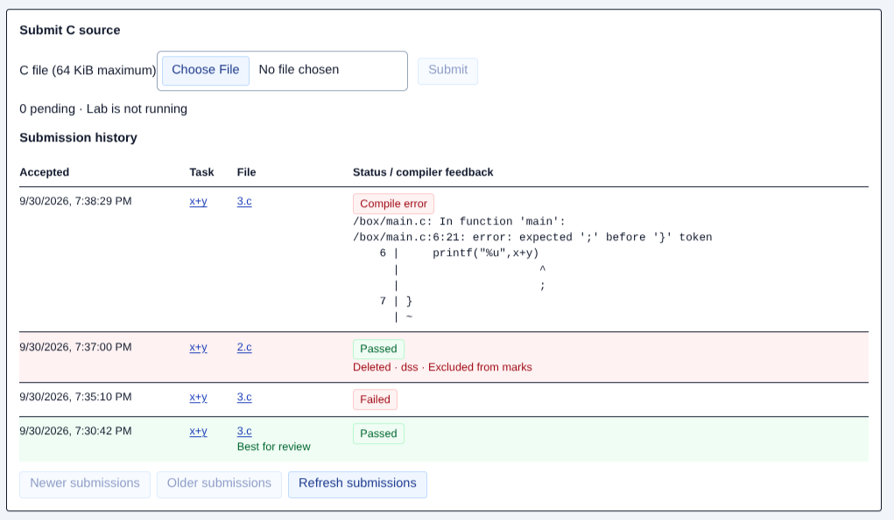
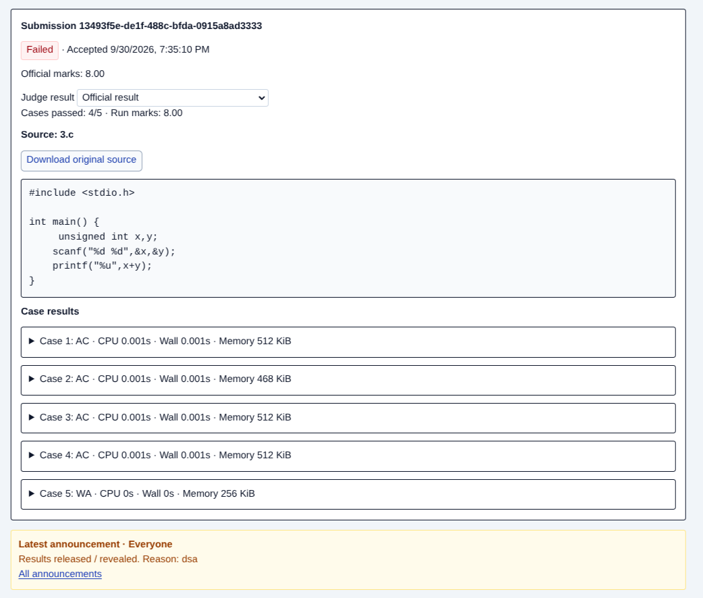
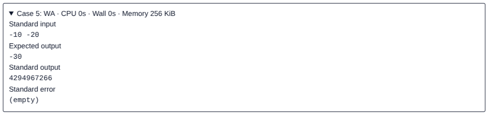

# cJudge TA Guide — Released Results

**Review flow:** open the student's lab → filter submissions → choose an attempt → inspect code and cases → report discrepancies.

## 1. Open the released lab

- Review the student's own logged-in screen; cJudge has no separate TA login. Do not ask for the student's password.
- Admin must release results **and enable reveal**. An ended lab alone does not expose details.
- Ask the student to open their lab and click **Submissions**. Confirm the name/roll number in the header.
- If details remain hidden, contact admin. Browser-binding problems also require admin assistance.

## 2. Choose the submission

1. Use **Filter by task**. History is newest first; navigate with **Older submissions**/**Newer submissions** if needed.
2. Start with the green **Best for review** row: the newest active attempt tied for the highest official score for that task.
3. Click its filename to open the submission. Check acceptance time and status.

Red **Deleted** rows show a reason and are excluded from marks. A **Passed** status is distinct from the green review highlight.

The review highlight selects the newest tied attempt; counted task marks use the best score, with the earliest attempt breaking ties. The student screen shows only that student's records.

## 3. Inspect code and marks

- Read **Source: …** directly; use **Download original source** only when needed.
- **Official marks** is this submission's current official score, not the student's lab total.
- **Cases passed** and **Run marks** describe the displayed judge result.
- If grading is in progress, previous official marks may remain visible. Wait for completion before treating them as final; **Pending** does not mean zero.

## 4. Inspect testcase results

Expand a row under **Case results**. Read the verdict, CPU time, wall time, and memory usage.

| Verdict | Meaning |
| --- | --- |
| AC | Output accepted. |
| WA | Output does not match the checker requirements. |
| TLE | Time limit exceeded. |
| MLE | Memory limit exceeded. |
| RE | Runtime error, such as a crash. |
| OLE | Output limit exceeded. |
| Compile error | Compilation failed; inspect compiler feedback. There may be no case rows. |

For a failed case, compare **Standard input**, **Expected output**, **Standard output**, and **Standard error**. Empty streams display **(empty)**. A **(truncated)** label means only a preview is available; do not assume it is the complete stream.

Passed cases show their verdict/resources, but their test streams remain hidden. A missing or delayed result requires admin attention, not an automatic zero.

## 5. Compare retained results and finish

1. Leave **Judge result** on **Official result** for the current score.
2. Select an earlier run to investigate rejudging. **Run marks** and cases change; **Official marks** remains the current score.
3. Note the **Viewing retained run** warning. Return to **Official result** before concluding.

For discrepancies, give admin the roll number, lab/task, submission ID, acceptance time, selected run, and relevant case/verdict. This screen cannot change marks, delete attempts, or request rejudging.

> **Screenshot T4 — Retained result:** Show the **Judge result** selector, an older run selected, the retained-run warning, and official versus run marks.
